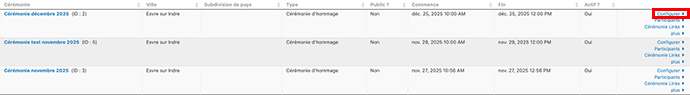

# Créer une cérémonie depuis un modèle

Allez dans **Cérémonies > Nouvelle Cérémonie**.

Dans **From Modèle**, choisissez le modèle que vous souhaitez utiliser.

Les informations provenant du Modèle s'affichent.  
Complétez les champs suivants : 

* **Cérémonie Titre** : ajoutez la date de la cérémonie. 
Ce champ sera utilisé dans les courriels destinés aux participants,
* Dates et heures de **Début** et de **Fin**.

Cliquez sur **Suivant** pour afficher les informations de localisation, elles aussi reprises du Modèle. 
Modifiez éventuellement et **Enregistrer**.

> Normalement les onglets Localisation et Communication n'ont pas à être modifiés.

## Pour voir les cérémonies disponibles
Allez à : **Cérémonies > Gérer les Cérémonies** 
Vous pouvez éditer les propriétés d'une cérémonie en cliquant sur **Configurer**.

