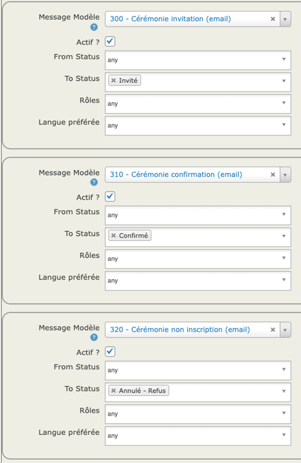

# Créer un modèle de cérémonie
Cette action n'est à réaliser qu'une fois : le modèle de cérémonie contient les informations de lieu, le titre, la description... Il sera utilisé pour créer chaque cérémonie

Allez dans **Cérémonies/Modèles de Cérémonie**.  
Les modèles de cérémonie disponibles s'affichent. Pour en ajouter un : **Add Cérémonie Modèle**.

> Le modèle **Modèle de Cérémonie Test** peut être utilisé comme base pour l'étape suivante.

## Infos et paramètres
Remplissez les informations sur le modèle de Cérémonie :

* **From Modèle** : vous pouvez utiliser un modèle préexistant comme base pour le modèle que vous créez.
> Un modèle **Modèle de Cérémonie Test** est livré avec la base. Il est conseillé de l'utiliser pour ne modifier que les informations nécessaires.
* **Cérémonie Titre** : c'est le titre par défaut des cérémonies filles.  
Par exemple vous pouvez entrer *"Cérémonie d'hommages aux donneurs et à leurs familles du"*, et compléter la date lorsque vous créerez une cérémonie fille.  
C'est ce titre qui apparaitra dans les courriels avec les proches.
* **Modèle Titre** : c'est le nom du modèle. 
Lorsque vous créerez une cérémonie fille, vous devrez choisir un modèle en utilisant ce nom. Il doit donc être assez parlant.
* **Cérémonie Type** : choisissez *Cérémonie d'hommage*.
* **Rôle par défaut** : choisir *Invité*
> Bien sectionner *Invité* comme rôle par défaut sinon vous devrez changer à chaque nouvelle inscription
* **Cérémonie Résumé** et **Description Complète** : pas utile de remplir ces champs.
* **Liste des participants** : Désactivé.
* **Nombre maximum de participants** : laisser vide.
* **Cérémonie is active** : cocher.  
Laisser les autres cases décochées.

Cliquez sur **Suivant** pour passer aux informations de localisation

## Localisation de la Cérémonie (location)
Vous pouvez utiliser un lieu existant ou en créer un nouveau.

Cliquez sur **Enregistrer** et passez à l'ongle communication.

## Communication

Cet onglet gère les messages qui sont envoyés aux participants des cérémonies.
### Champs Send From, Reply To, CC, CCI

Vous pouvez modifier l'expéditeur par défaut et entrer une adresse recevant une copie des messages, cachée (CCI) ou non (CC).
### Statuts des participants
Les participants peuvent avoir trois statuts :

* **Invité** : vous lui avez envoyé un message l'invitant à une cérémonie,
* **Confirmé** : le participant a confirmé sa participation à une cérémonie,
* **Annulé** : le participant ne participera pas à la cérémonie.

### Paramétrage des messages
* 300 - Cérémonie invitation (email)
* 310 - Cérémonie confirmation (email)
* 320 - Cérémonie non inscription (email)

Vous n'avez normalement pas besoin de les modifier.  
Si vous souhaitez le faire : **Mailling > Modèles de Messages** 
Puis **Edit** pour modifier le message

### Association Message - Action
L'onglet communication permet d'associer le passage d'un statut à l'autre à l'envoi automatique d'un message : 

* Le passage au statut **Invité** fait partir une invitation (300 - Cérémonie invitation),
* Le passage au statut **Confirmé** fait partir une confirmation de la participation à la cérémonie (310 - Cérémonie confirmation),
* Le passage au statut **Annulé Refus** accuse réception de la non-participation à la cérémonie (320 - Cérémonie non inscription).

