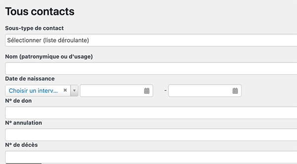
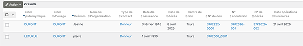

# Types de contacts
CiviCRM gère différents types de contacts qui ont chacun leur fiche :

* *individus* : donneurs, proches, demandeurs d'information, personnels des centres de dons
* *organisations* : centres de dons, lieux de conservation, mairies, pompes funèbres...
L'affichage est différent selon le type de contact.

# Rechercher un contact
Tous les contacts sont accessibles via **Rechercher > Tous contacts**
La partie haute de la page contient des filtre pour limiter les résultats :

* *Sous-type de contact* : choisissez les contacts à afficher dans le menu déroulant qui s'affiche,
* *Nom* : indiquez le nom du contact ; la recherche se fait sur les noms patronymique(de naissance) et d'usage,
* *Date de naissance* : vous pouvez choisir une date précise ou un intervalle,
* *N° de don, N° d'annulation, N° de décès*.

Vous pouvez cliquer sur les noms, les numéros de dossier, d'annulation ou de décès pour accéder à la fiche du contact recherché.   
D'autres recherches, similaires sont disponibles dans le menu **Rechercher**