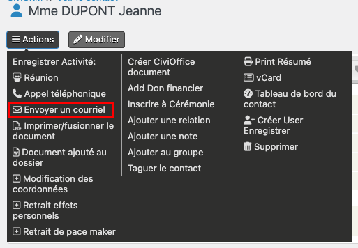
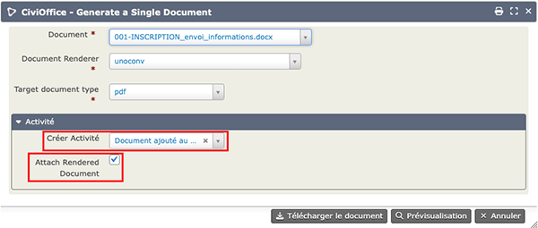

# Demandes d'information
Les futurs donneurs doivent recevoir une information complète et disposer d'un délai de réflexion avant leur inscription définitive.  
Vous devez leur fournir le [guide d'information officiel, disponible sur le site du MESRI](https://www.service-public.gouv.fr/particuliers/vosdroits/R65575). 
Ils sont donc tout d'abord créés sous la forme de <strong>Demandeurs d'information</strong> qui seront transformés en **Donneurs** s'ils poursuivent leur démarche.

## Créer un demandeur d'information
Allez à : <strong>Contacts > Nouveau Demandeur d'information</strong> et remplissez les informations demandées :

Après avoir enregistré, une fiche plus complète s'ouvre.  
Complétez les informations de contact (adresse, email, téléphone).  
La date d'envoi des informations permet la purge des personnes n'ayant pas donné suite après un an.

## Envoyer les documents
Des courriels et des courriers sont disponibles pour envoyer les documents au demandeur d'information : 
### Par courriel
Le courriel invite le demandeur à consulter le site du centre d'accueil des corps et à télécharger le guide officiel et le document de promesse de don. 

Pour envoyer le courriel, allez dans la fiche Contact : <Strong>Actions > Envoyer un courriel</Strong> 
> Cette action n'est visible que si vous avez renseigné un courriel dans la fiche contact. 

Choisissez le modèle <Strong>001 - Préinscription: envoi informations MAIL</Strong>, puis <Strong>Téléchargez le document</Strong>.  
Le mail est envoyé et une activité est ajoutée dans l'onglet <Strong>Activité</Strong> de la fiche contact.
### Par courrier
Allez dans la fiche Contact : <Strong>Actions > Créer CiviOffice document</Strong>.

Choisissez le modèle <Strong>001-INSCRIPTION_envoi_informations</Strong>, puis <Strong>Télécharger le document</Strong>.
Envoyez-le par courrier en y joignant :

* le guide officiel, 
* la promesse de don,
* et la déclaration RGPD.

Pour conserver une trace de cet envoi dans la base :

* <Strong>Créer une activité : Document ajouté au dossier</Strong> : crée une activité supplémentaire dans l'onglet Activités de la fiche Contact,
* Cocher la case <Strong>Attach Rendered Document</Strong> : ajoute le pdf en pièce jointe à cette activité.

> Si vous omettez de créer une activité et d'attacher le document, cet envoi ne sera pas tracé.

