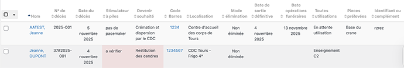

# Tableau de bord des corps présents
Allez à **Corps et pièces anatomiques > Tableau de bord des corps présents**

Cette page affiche les corps arrivés (date d'arrivée au CDC antérieure à la date du jour) au laboratoire et non encore sortis pour les opérations funéraires (date de sortie définitive postérieure à la date du jour).

Il est possible de trier par n° de décès, par nom, code-barres, médium injecté, localisation, ou mode d'élimination.

> Des alertes s'affichent sous forme d'un surlignement : 
        - si une restitution était souhaitée par le donneur,  
        - si un numéro de décès n'a pas été attribué,  
        - ou si un stimulateur cardiaque n'a pas été retiré ou si son absence n'a pas été vérifiée.