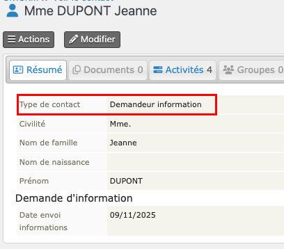

# Créez la fiche donneur
La fiche donneur peut être crée à partir de celle d'un demandeur d'information (défaut) ou *de novo*.
## A partir de la fiche d'un demandeur d'information

* Recherchez le demandeur d'information : <Strong>Recherchez > Tous Contacts</Strong>.  
* Vous pouvez limiter au sous-type de contact <Strong>Demandeur d'information</Strong> ou filtrer par le nom de famille.  
* Cliquez sur le nom du demandeur d'information que vous voulez inscrire comme donneur pour ouvrir sa fiche.

* Cliquez sur **Type de Contact** et choisissez **Donneur**.  
Rechargez la page pour afficher la fiche Donneur.

## *De novo*
* Allez à : **Contacts > Nouveau Donneur**, entrez les informations demandées et **Enregistrez**.   
La fiche Donneur s'ouvre.