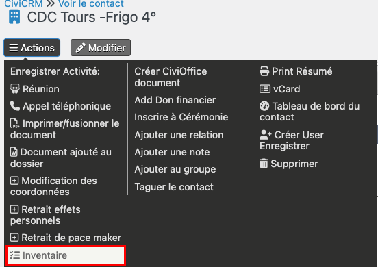
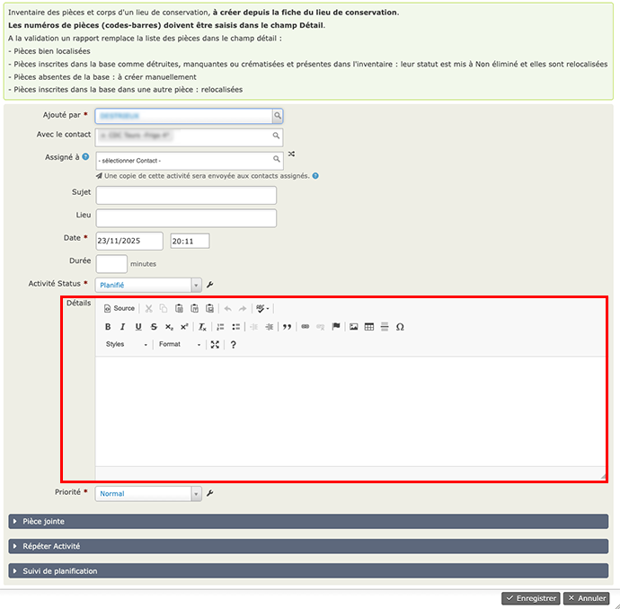

# Inventaires
Les inventaires permettent de vérifier la bonne localisation et le statut (*Non eliminée, Manquante, Destruction...*) des pièces et des corps.
## Créer un nouvel inventaire
Les inventaires sont créés sous la forme d'activité de type *Inventaire* depuis un des lieux de conservation des corps.
>Ne pas créer d'inventaire depuis une fiche de contact mais depuis une fiche de lieu de conservation ou de centre d'accueil des corps.

**Actions > Inventaire**

Dans le formulaire qui s'ouvre, entrez les numéros de pièces (codes-barres) dans le champ *Détails*, puis **Enregistrer**

Les numéros de pièces et de corps sont comparées à la base de données.

* Pièces localisées dans cette pièces dans la base et l'inventaire : le nom de l'inventaire est ajouté au champ *Inventaire* de l'*Utilisation*.
* Pièces non présentes dans la base et trouvées dans cet inventaire : vous devez créer les pièces dans la base.
* Pièces localisées ailleurs dans la base mais trouvées dans cette pièce : relocalisées dans ce lieu et inventaire ajouté au champ *Inventaire* de l'*Utilisation*.
* Pièces notées détruites ou manquantes ou crématisées dans la base : relocalisées dans ce lieu et modification de leur statut.

Un rapport reprenant ces informations remplace le champ Détail de l'activité.

Les Inventaires sont disponibles dans l'onglet *Activités* de la fiche contact.

## Comparer les inventaires au contenu des lieux de conservation
Allez à **Corps et Pièces anatomiques > Inventaires**
Choisissez : 

* La localisation que vous souhaitez vérifier : la liste des pièces attachées à ce lieu s'affichent.
* Pour trouver les pièces faussement présentes dans cette pièce dans la base, sélectionner l'inventaire que vous souhaitez comparer à la base. Les pièces qui ont été retrouvées dans cet inventaire sont masquées.
* Les pièces qui restent sont celles qui sont localisées par erreur dans ce lieu de stockage.

Pour relocaliser les pièces : 

* Vous pouvez ouvrir chacune des fiches
* ou bien le faire en lot
    * selectionner celles à modifier dans la liste, 
    * puis **Action > Mettre à jour Utilisation du corps**,
    * **Add Value** : Localisation ; Selectionner le nouveau lieu, puis *Mettre à jour*.
