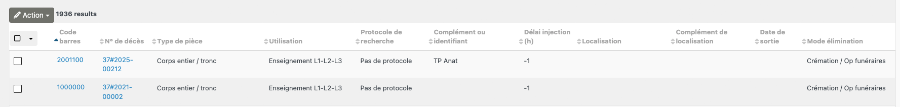
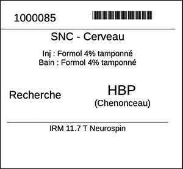

# Tableau de bord des pièces prélevées
Allez à **Corps et pièces anatomiques > Recherche Code Barres**

Cette page permet de rechercher une pièce ou un corps par son identifiant numérique

Il est possible de filter par n° code-barres, type de pièce, localisation, protocole, type d'utilisation ou mode d'élimination.

Il est possible d'imprimer une étiquette comportant :

* l'identifiant numérique du corps et son code barres
* le type de pièce
* le médium utilisé pour une injection éventuelle
* la nature du bain de conservation
* le type d'utilisation (Recherche, enseignement...)
* Le protocole de recherche éventuel
* un complément (n° protocole, précision sur utilisation...)
* les imageries éventuellement réalisées

* Sélectionnez le corps pour lequel l'étiquette doit être imprimée

Pour générer l'étiquette : **Action > Create Documents**, choisir *082-ETIQUETTES-contenu.docx*

