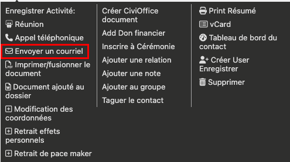

# Envoyer un courriel à un seul contact
Si vous souhaitez envoyer un courriel à un contact, il faut qu'il ait une adresse valide ... et qu'il ne soit pas décédé !

Allez dans sa fiche : **Actions > Envoyer un courriel**.

Dans la fenêtre qui s'ouvre, les informations d'expéditeur et de destinataires sont préremplies. 
Vous pouvez les modifier ou ajouter des destinataires en copie (CC/CCI)

Vous pouvez utiliser un modèle prédéfini ou bien composer un message *de novo*.   Les champs de fusion (tokens) permettent de récupérer des informations provenant de la base pour les intégrer aux messages.
