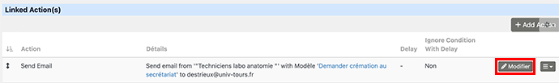

# Modification des règles CiviRules
CiviCRM utilise CiviRules pour exécuter des actions en fonction de certains paramètres.  
Il faut modifier l'adresse courriel de votre prestataire funéraire dans la règle qui lui envoie un message en cas de demande de départ de crémation.

Allez à **Administrer > CiviRules > Manage rules** pour afficher les règles disponibles.

Dans la ligne *Envoyer mail de demande de crémation*, sélectionnez **Modifier**.

Allez dans la section **Linked action > Send Email > Modifier**.

Complétez les champs suivants : 

* **Nom de l'expéditeur** : par exemple *Techniciens du laboratoire d'anatomie de XXX*,
* **Adresse électronique de l'expéditeur** : l'adresse des techniciens,
* **Alternative email address** : l'adresse de votre prestataire funéraire qui recevra les demandes de crémation.

