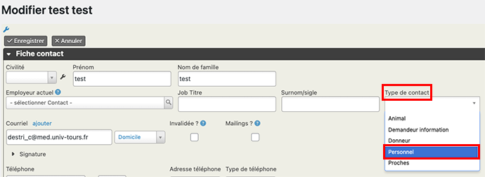

# Paramètres à régler par l'utilisateur
## Modification des modèles de courrier
Le système comporte de nombreux modèles de courriers dont la description est disponible [ici](../GuideUser/documents/docsdispo.md).

Ce sont des documents Word que vous pouvez modifier.
Avant la première utilisation, vous devez revoir chacun de ces documents pour utiliser votre propre en-tête.
> Prenez bien garde à ne pas modifier les *tokens* qui sont du texte encadré par accolades {} et correspondent à des informations qui sont récupérées dans la base pour générer les courriers.
> Si vous souhaitez ajouter des *tokens* à vos documents, leur liste est disponible dans **CiviOffice > Available tokens**

## Personnels du centre de don du corps
Les utilisateurs créés par l'administrateur dans Wordpress sont normalement automatiquement créés dans la base mais ne sont pas rattachés à votre organisation.  

Pour rattacher un utilisateur à votre centre, recherchez sa fiche : 
**Rechercher > Tous contacts**.

Dans la fiche, cliquez sur **Modifier**,  
Changez le **Type de contact** pour *Personnel*. **Enregistrer**

Complétez la fiche qui s'affiche, notamment : 

* **Fonction** : Préparateur, Gestionnaire, Directeur...
* **Centre d'accueil des corps** : votre centre d'accueil ; pour le retrouver tapez %, tous les centres s'affichent,
* **Métier** : BIATS ou enseignant chercheur, 
* **Catégorie et BAP** : pour les BIATS,
* **Contrat** : Titulaire, CDI, CDD,
* **Dates de début et de fin des fonctions**.

## Lieux de conservation des pièces et des corps
Vous devez créer les lieux de conservation des corps et des pièces internes ou externes (collaborateurs) à votre centre.

La procédure est décrite [ici](../GuideUser/donneur/anonymat/lieux.md).

## Entreprises de pompes funèbres
Pour ajouter une entreprise de pompes funèbres :   
**Contacts > Pompes funèbres > Nouvelle entreprise de pompes funèbres**

* Entrez le nom de l'entreprise, puis **Enregistrer**,
* Une fiche plus complète s'ouvre pour y entrer des informations.